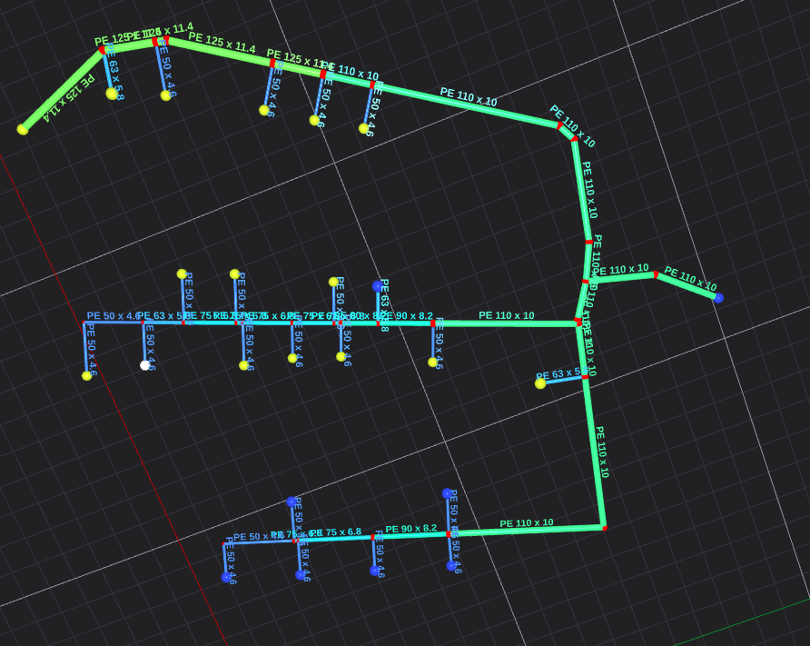

# heating_demand * fraction * distance


| Demand (W) | Distance | Cost = Demand × Distance |
| ---------- | -------- | ------------------------ |
| 5,000      | 500      | 2,500,000                |
| 15,000     | 200      | 3,000,000                |


- yellow source to farthest yellow
- 1439 
    - 5.25 kw * 396 = 2079k

- blue 1443 
    - 7.85kw  * ~350 = 2747k
---

    Path from Source 1371 to Building 1446: Distance = 93.0372

    Path from Source 1485 to Building 1446: Distance = 283.568

1446 7500

- 7.5 kW * 93 = 697.5
- 7.5kW * 283.5 = 2126.25

Path from Source 1371 to Building 1460: Distance = 274.232

Path from Source 1485 to Building 1460: Distance = 464.763

1460
- 6975 W
- 6.975 * 274.232 = 1912.7682
- 6.975 * 464.763 = 3241.721925

total 697.5 + 3241.721925 = 3939.221925 k
total 2126+ 1912.7682 = 4038.7682 k


# ditsnce ^2




| Demand | Distance | Cost = Demand × Distance²      |
| ------ | -------- | ------------------------------ |
| 5,000  | 500      | 5,000 × 250,000 = **1.25×10⁹** |
| 15,000 | 200      | 15,000 × 40,000 = **600×10⁶**  |


| Demand | Distance | Cost = Demand × Distance x 100  |
| ------ | -------- | ------------------------------ |
| 5,000  | 500      | 5,000 × 50,000 = **1.25×10⁹** |
| 15,000 | 200      | 15,000 × 20,000 = **300×10⁶**  |
----

- Consumer 1453 (demand = 6975): 

    Path from Source 1371 to Building 1453: Distance = 199.185 

    Path from Source 1485 to Building 1453: Distance = 389.716 


- Consumer 1460 (demand = 6975): 
    Path from Source 1371 to Building 1460: Distance = 274.232 
    
    Path from Source 1485 to Building 1460: Distance = 464.763 
    
- Allocation 
Consumer 1453 (demand = 6975): 
    Source 1371: 6975 units (100%) 
    Source 1485: 0 units (0%) 
Consumer 1460 (demand = 6975): 
    Source 1371: 0 units (0%) 
    Source 1485: 6975 units (100%)

1453 from S1371 → 6975 × 199.185 = 1,389,404

1453 from S1485 → 6975 × 389.716 = 2,716,804

1460 from S1371 → 6975 × 274.232 = 1,913,777

1460 from S1485 → 6975 × 464.763 = 3,243,766


| Option                              | Total Cost                                                      |
| ----------------------------------- | --------------------------------------------------------------- |
| Assign 1453 to S1371, 1460 to S1485 | **1,389,404 + 3,243,766 = 4,633,170** ✅                         |
| Assign 1460 to S1371, 1453 to S1485 | **1,913,777 + 2,716,804 = 4,630,581** ❌ slightly better, but... |


## epsilon = 1e-6
```bash
    obj[var_idx] = distance_ij * demand_j + epsilon * distance_ij;
``

Consumer 1453 (demand = 6.975):
  Source 1371: 6.975 units (100%)	Obj 1389.31
  Source 1485: 0 units (0%)	Obj 2718.27

Consumer 1460 (demand = 6.975):
    Source 1371: 0 units (0%)	Obj 1912.77
    Source 1485: 6.975 units (100%)	Obj 3241.72

1389.31+ 3241.72 = 4631.03 - current

2718.27+ 1912.77 = 4631.04


## epsilon 1e-3
Consumer 1453 (demand = 6.975):
  Source 1371: 6.975 units (100%)	Obj 1389.51
  Source 1485: 0 units (0%)	Obj 2718.66

Consumer 1460 (demand = 6.975):
  Source 1371: 0 units (0%)	Obj 1913.04
  Source 1485: 6.975 units (100%)	Obj 3242.19

  1389.51 + 3242.19 = 4631.7
  2718.66 + 1913.04 = 4631.7
## epsilon e-2

Consumer 1453 (demand = 6.975):
  Source 1371: 6.975 units (100%)	Obj 1391.31
  Source 1485: 0 units (0%)	Obj 2722.17

Consumer 1460 (demand = 6.975):
  Source 1371: 0 units (0%)	Obj 1915.51
  Source 1485: 6.975 units (100%)	Obj 3246.37

1391.31 + 3246.37 = 4637.68
2722.17 + 1915.51 = 4637.68

## epsilon e-1
Consumer 1453 (demand = 6.975):
  Source 1371: 6.975 units (100%)	Obj 1409.23
  Source 1485: 0 units (0%)	Obj 2757.24